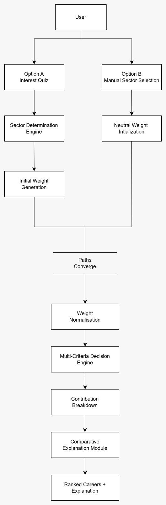
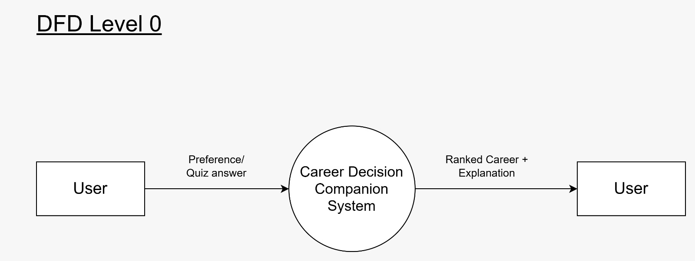
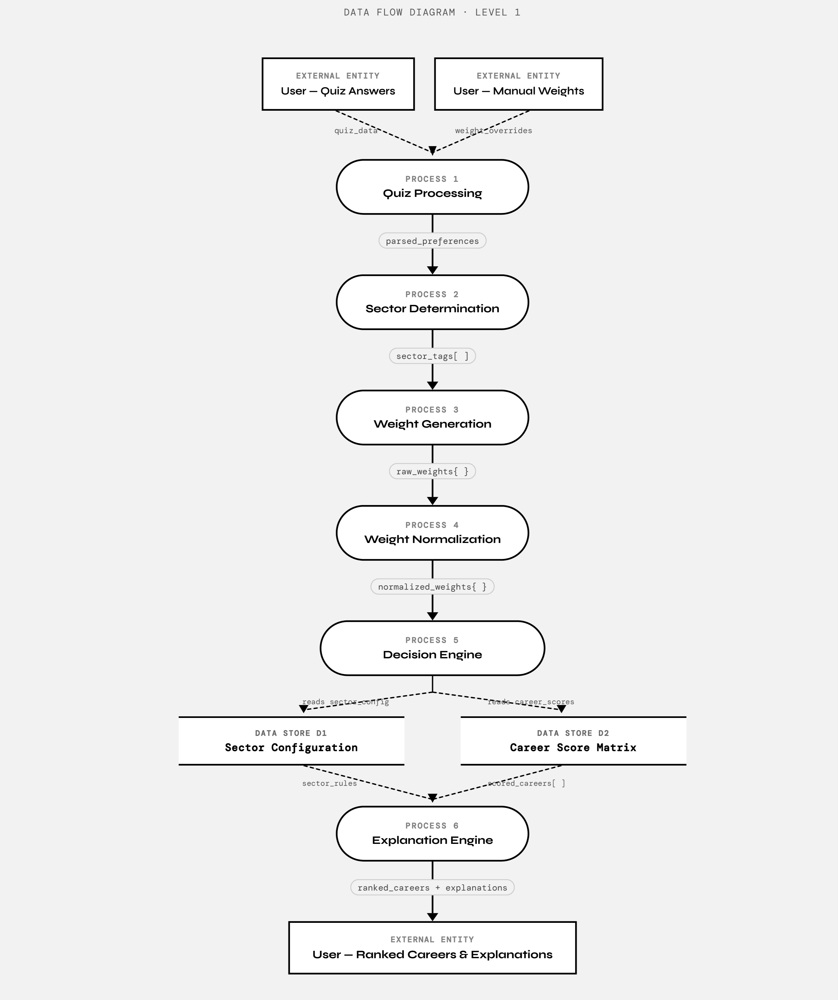

# 🎯 Career Decision Companion System

> A structured, data-driven tool to help engineering graduates evaluate and choose careers — transparently, personally, and without guesswork.

---
## Live Demo

Frontend: https://career-decision-companion.netlify.app/  
Backend API: https://career-decision-companion.onrender.com

**Note**: "The backend may take 30-60 seconds to respond on first load as it runs on Render's(render.com) free tier.”

The live deployment demonstrates production-ready API routing, CORS configuration, and stateless backend architecture.

---

### Problem Understanding

Career decision-making is inherently multi-dimensional. Engineering graduates must evaluate conflicting factors such as salary potential, job demand, learning curve difficulty, lifestyle balance, and long-term growth. These factors vary in importance from person to person, making purely emotional or trend-driven decisions unreliable.

The **Career Decision Companion System** models career selection as a structured **multi-criteria decision problem**, enabling users to evaluate trade-offs transparently and quantitatively.

---
## Tech Stack

| Layer | Technology | Purpose |
|---|---|---|
| Frontend | React.js | UI, slider inputs, quiz flow |
| Backend | FastAPI (Python) | REST API, request handling |
| Decision Engine | Python | Weighted scoring, normalization |
| Hosting (Frontend) | Netlify | Static site deployment |
| Hosting (Backend) | Render | Python API deployment |
| Version Control | GitHub | Source code management |

---

## System Design

The Career Decision Companion System is designed as a modular, deterministic decision engine that evaluates career options using weighted multi-criteria decision analysis. The system prioritizes **transparency**, **flexibility**, **explainability**, and **extensibility**.

  

## 1. Architectural Overview

The system is logically divided into five components: the **Input Handler** collects user-defined importance values; the **Normalization Module** converts importance ratings into proportional weights; the **Scoring Engine** computes final weighted scores for each career; the **Ranking Module** sorts careers based on computed scores; and the **API Layer** exposes evaluation functionality via REST endpoint. This modular structure ensures clean separation of responsibilities and future scalability.

  ## Architecture Diagram
    


  ## Data Flow Diagram level 0
    

  ## Data Flow Diagram level 1
    

  ## 2. Data Model

The system internally stores structured data using dictionary-based models. Weight values are dynamically computed from user-provided importance ratings at runtime — the example above shows a representative normalized output. Career scores follow the same structure, with each career mapped to its scores across all six criteria.

---

## Career Options

The system supports multiple career sectors, including **Technology**, **Finance**, **Government Services**, and **Management & Business**.

Each sector contains multiple career paths. For example:

- **Technology:** Web Development, Data Science, AI/ML Engineering, Cybersecurity, Cloud/DevOps  
- **Finance:** Financial Analyst, Investment Banking, Risk Analyst  
- **Government Services:** Civil Services, Public Administration, Regulatory Services  
- **Management & Business:** Product Management, Business Analysis, Operations Management  

Each career is evaluated across sector-specific criteria such as salary growth, job demand, market vacancy (India), work-life balance, learning curve, and long-term growth.

All criteria are rated on a **1–10 scale**, and importance values are dynamically normalized based on user input.

---

## Evaluation Criteria

| Criterion | What It Measures | Scale |
|---|---|---|
| Salary Potential | Expected compensation levels | 1–10 |
| Job Demand | Current and projected hiring activity | 1–10 |
| Learning Curve Difficulty | Effort required to reach proficiency | 1–10 |
| Personal Interest | Subjective engagement and passion | 1–10 |
| Work-Life Balance | Typical hours, flexibility, and stress | 1–10 |
| Future Growth | Long-term career trajectory and relevance | 1–10 |

---

### Input Model

Users rate the **importance** of each criterion on a 1–10 scale using sliders in the frontend. Instead of requiring weights to manually sum to 1, the system automatically normalizes the importance values:

```
weight_i = importance_i / Σ importance
```

This ensures **proportional influence**, **mathematical correctness**, and an improved user experience with no manual balancing required. Career performance scores are predefined within the system and represent structured domain assumptions.

---

### Scoring Methodology

#### Decision Model

The system evaluates careers using **deterministic weighted aggregation**. After normalizing user-provided importance values, the system computes:

```
Final Score = Σ (normalized_weight × career_score)
```

Careers are then ranked in descending order of final score. This approach ensures **personalization** (users control importance), **transparency** (no black-box logic), **reproducibility** (same input → same output), and **structured trade-off evaluation**.

**Example normalized weights:**

```python
weights = {
    "Salary Potential":          0.30,
    "Job Demand":                0.25,
    "Learning Curve Difficulty": 0.15,
    "Personal Interest":         0.20,
    "Work-Life Balance":         0.10,
    "Future Growth":             0.00  # dynamically computed from user input
}
```

**Example API request/response:**

```json
// POST /evaluate
{
  "importance": {
    "Salary Potential": 9,
    "Job Demand": 7,
    "Learning Curve Difficulty": 5,
    "Personal Interest": 8,
    "Work-Life Balance": 6,
    "Future Growth": 9
  }
}

// Response
{
  "rankings": [
    { "career": "AI/ML Engineering", "score": 8.42 },
    { "career": "Data Science",      "score": 8.15 },
    { "career": "Cloud/DevOps",      "score": 7.90 },
    { "career": "Cybersecurity",     "score": 7.45 },
    { "career": "Web Development",   "score": 7.12 }
  ]
}
```

---

## Deployment Details

The system is deployed in a production-like environment using:

- **Netlify** for frontend static hosting
- **Render** for backend API hosting

  ### Production Configuration

  - The frontend communicates with the deployed backend API at `https://career-decision-companion.onrender.com`
  - CORS is explicitly configured in FastAPI to allow secure cross-origin communication between frontend and backend
  - The backend runs as a stateless service, ensuring scalability and deployment compatibility
  - No sensitive credentials are exposed in the frontend
  - The backend automatically restarts on code changes via GitHub integration with Render

  This deployment demonstrates that the system is not limited to local execution and operates in a production-ready architecture with clean separation between frontend and backend concerns.

---

### Assumptions

- Criteria are treated as **independent dimensions** (no interaction effects modeled).
- Career performance scores are **structured domain approximations**, not sourced from live data.
- The model simplifies qualitative emotional factors into numerical form.
- The system provides **structured guidance**, not absolute truth, and does not account for regional job market variation or individual educational background.

---

## System Overview

The system is implemented as a full-stack web application built with 
**React + Vite** on the frontend and **FastAPI (Python)** on the backend...

```bash
# Backend (FastAPI)
pip install -r requirements.txt
uvicorn app.main:app --reload
# API at http://localhost:8000 | Docs at http://localhost:8000/docs

# Frontend (React)
cd frontend && npm install && npm run dev
# App at http://localhost:5173
```

The stack is divided into four components: **Frontend (React)** collects user preferences through slider-based inputs and displays ranked results. **Backend (FastAPI)** exposes a REST API, normalizes importance values, and delegates computation to the decision engine. The **Decision Engine** performs deterministic weighted aggregation and produces ranked output. The **Domain Configuration Layer** defines career options, evaluation criteria, and stores default performance scores. The architecture ensures clean separation of concerns between presentation, computation, and domain configuration.

---

## Development Log

## Day 6 - Explanation Engine

* To improve transparency, the system includes a deterministic explanation module.
* Instead of returning only ranked scores, the system:
* Computes weighted contribution per criterion for each career.
* Identifies the top contributing criteria for the highest-ranked career.
* Generates a structured explanation highlighting why that career ranked highest.

This ensures:

-> Full traceability from user input to final output.
-> No black-box reasoning.
-> Clear alignment between user priorities and final recommendation.

The explanation is mathematically derived from contribution values rather than generated using AI models.

## Day 7 - Market Vacancy (India) 

To improve real-world applicability, the system incorporates a Market Vacancy (India) criterion within each sector.

This score:

* Represents approximate relative job availability trends in India.
* Is modeled as a structured domain factor.
* Is not derived from live scraping or external APIs.
* Enhances realism by integrating supply-side dynamics.
* Because the decision engine is generic, adding this criterion required no changes to scoring logic — demonstrating architectural scalability.

-----------

## Day 8 - Sector-Aware Interest Quiz

The initial quiz implementation mapped directly to technology-sector criteria.
In Day 10, the design was refactored to introduce a preference abstraction layer.

The quiz now:

* Collects abstract preference signals (e.g., financial growth, stability, challenge tolerance).
* Dynamically maps those signals to sector-specific criteria.
* Generates weight vectors compatible with any sector.
* Preserves deterministic and explainable logic.

This enhancement ensures:

* Cross-sector compatibility
* Architectural scalability
* Separation between preference elicitation and evaluation engine
* No modification required in core scoring algorithm

The quiz does not predict personality traits.
It converts structured qualitative inputs into quantitative weight distributions.

-------

## Day 9 - Two-Stage Decision Flow (Sector → Career)

On Day 8, the system was redesigned to introduce a structured two-stage decision process.
Instead of asking users to manually select a sector, the system now:
1. Collects preference signals through an interest quiz.
2. Determines the most aligned sector.
3. Generates initial criterion weights for that sector.
4. Allows the user to fine-tune priorities using sliders.
5. Ranks careers within the recommended sector.

This separates:

* Macro-level alignment (Which sector suits the user?)
* Micro-level optimization (Which career inside that sector fits best?)

The architecture now consists of:
* Preference Layer (Quiz)
* Sector Recommendation Engine
* Weight Generation Engine
* Deterministic Career Scoring Engine

This ensures:
* Improved usability
* Reduced cognitive load
* Strong separation of concerns
* Explainable and reproducible outputs

No AI model is used for inference. The system remains deterministic and transparent.

-------

## Day 10 - Dual Entry Flow (Quiz + Manual Mode) 

The system now supports two entry paths:

1. Interest Quiz (Recommended)
  * User answers 6 abstract preference questions.
  * The system determines the most aligned sector.
  * Initial criterion weights are generated automatically.
  * User can fine-tune weights using sliders.
  
2. Manual Sector Selection
  * User directly selects a sector.
  * Sliders initialize with neutral weights (default = 5).
  * User adjusts importance and evaluates careers.
  
  This design improves usability by:
  * Reducing cognitive load for uncertain users.
  * Allowing experienced users to skip the quiz.
  * Preserving deterministic scoring logic.
  * Maintaining full transparency of the decision process.
  * Ensuring flexibility without introducing black-box inference.

  ----

## Day 11 - Comparative Explanation Module (Why Not Others?) 

To improve analytical depth, the system now includes a comparative explanation module.

After ranking careers, the system:
* Compares the top two alternatives.
* Calculates contribution differences per criterion.
* Identifies the strongest differentiating factors.
* Explains why the second-ranked career scored lower.

Example:

The second-ranked career scored lower mainly due to weaker performance in Market Vacancy (India) and Work-Life Balance compared to the top-ranked option.

This enhancement improves:

* Decision transparency
* Trade-off visibility
* User trust
* Analytical maturity

The comparison logic remains fully deterministic and does not rely on LLM-based generation.

---

## Day 12 - UI & Explainability Enhancements

The system interface was refined to improve usability and visual clarity.

## UI Improvements
- Introduced centered card-based layout.
- Added visual hierarchy and spacing improvements.
- Cleaned quiz rating scale to minimal 1–5 numeric format.
- Highlighted top-ranked career visually.
- Structured ranking display for better readability.

## Comparative Explanation Layer

In addition to overall explanation, the system now provides:

- A structured comparison between Rank #1 and Rank #2.
- Explicit reasoning for why the top career outperforms the second.
- Quantified score difference for clarity.

This improves transparency and strengthens the decision-support nature of the system.

The system now operates with:

1. Sector identification (macro-level)
2. Weighted scoring (micro-level)
3. Contribution analysis
4. Comparative reasoning layer

This layered approach enhances interpretability while preserving deterministic logic.

---

## Reflection

This project evolved from a simple weighted scoring prototype into a multi-layered decision-support system with sector abstraction, comparative reasoning, and production deployment. Throughout development, I prioritized deterministic logic over black-box AI to preserve transparency and traceability. Each iteration focused on reducing cognitive load while improving architectural separation and explainability. If extended further, the next improvements would include real-time market data integration and adaptive qualification filtering. The system demonstrates how structured modeling can bring clarity to ambiguous real-world decisions.